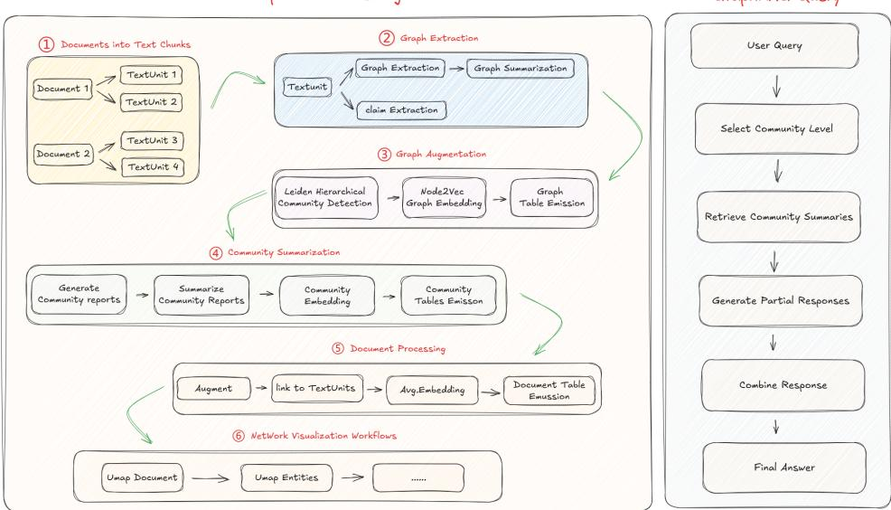

# Deepseek企业级Agent项目开发实战

# Part 4. Microsoft GraphRAG Query构建流程详解

在完成了Microsoft GraphRAG的索引构建及自定义接入图数据库Neo4j构建完整的知识图谱后，我们在上一小节课程中已经初步实践了可以通过Cypher语句来查询结构化数据中的信息。当然，传统的Cypher 查询方式，需要我们具备一定的图数据库知识，对非技术人员来说，使用门槛较高。 而Microsoft GraphRAG 则提供了一种更为直观、易用的查询方式，我们只需要输入自然语言查询，即可获得结构化的查询结果。

这就需要我们了解Microsoft GraphRAG使用的第二阶段，即查询（Query）阶段。

索引阶段我们利用大语言模型结合提示工程，从非结构化文本（.txt、.csv）中提取出实体（Entities）与关系（Relationships），构建出了基础的 Knowledge Graph ，并且通过建立层次化的community 结构， community 以及 community_report 的丰富语义，相较于传统基于 Cypher 的查询方式可以提供更多灵活性的 Query 操作， Microsoft GraphRAG 在项目开源之初是提供了 local 和global 两种查询方式，分别对应了 local search 和 global search ，而后在不断的迭代更新过程中，除了优化了 local search 和 global search 的效果，还新增了 DRIFT Search 和 Multi IndexSearch 作为扩展优化的可选项，以进一步丰富 Query 操作的多样性。

如下图所以，原图来源于 Microsoft GraphRAG 的官方论文：https://arxiv.org/pdf/2404.16130

Microsoft GraphRAG 在查询阶段构建的流程，相较于构建索引阶段会更为直观，核心的具体步骤

# 包括：

1. 接收用户的查询请求。

2. 根据查询所需的详细程度，选择合适的社区级别进行分析。

3. 在选定的社区级别进行信息检索。

4. 依据社区摘要生成初步的响应。

5. 将多个相关社区的初步响应进行整合，形成一个全面的最终答案。

通过学习Microsoft GraphRAG索引构建的源码大家应该已经能够清晰的知道，Indexing 过程中并不是在创建完第一层社区后就停止了，而是是分层的。也就是说，当创建第一层社区（即基础社区）后，会将这些社区视为节点，进一步构建更高层级的社区。这种方法就实现在知识图谱中可以以不同的粒度级别上组织和表示数据。比如第一层社区可以包含具体的实体或数据，而更高层级的社区则可以聚合这些基础社区，形成更广泛的概览。

因此最核心的 Local Search 和 Global Search 的实现，就是源于不同的粒度级别而构建出来用于处理不同类型问题的 Pipeline , 其中：

Local Search 是基于实体的检索。  
Global Search 则是基于社区的检索。

# graphrag query 命令参数说明

<table><tr><td rowspan=1 colspan=1>参数名称</td><td rowspan=1 colspan=1>类型</td><td rowspan=1 colspan=1>描述</td><td rowspan=1 colspan=1>默认值</td><td rowspan=1 colspan=1>是西必需</td></tr><tr><td rowspan=1 colspan=1>--method</td><td rowspan=1 colspan=1>Tpye</td><td rowspan=1 colspan=1>可以选择local、global、drift或basic算法。</td><td rowspan=1 colspan=1>None</td><td rowspan=1 colspan=1>是</td></tr><tr><td rowspan=1 colspan=1>--query</td><td rowspan=1 colspan=1>TEXT</td><td rowspan=1 colspan=1>要执行的查询，即提出的问题。</td><td rowspan=1 colspan=1>None</td><td rowspan=1 colspan=1>是</td></tr><tr><td rowspan=1 colspan=1>--config</td><td rowspan=1 colspan=1>PATH</td><td rowspan=1 colspan=1>要使用的配置文件路径。</td><td rowspan=1 colspan=1>None</td><td rowspan=1 colspan=1>否</td></tr><tr><td rowspan=1 colspan=1>--data</td><td rowspan=1 colspan=1>PATH</td><td rowspan=1 colspan=1>索引管道输出目录（即包含parquet 文件的目录）。</td><td rowspan=1 colspan=1>None</td><td rowspan=1 colspan=1>否</td></tr><tr><td rowspan=1 colspan=1>--root</td><td rowspan=1 colspan=1>PATH</td><td rowspan=1 colspan=1>项目根目录的路径。</td><td rowspan=1 colspan=1>·</td><td rowspan=1 colspan=1>否</td></tr><tr><td rowspan=1 colspan=1>--community-1eve1</td><td rowspan=1 colspan=1>INTEGER</td><td rowspan=1 colspan=1>从中加载社区报告的 Leiden 社区层级。较高的值表示来自较小社区的报告。</td><td rowspan=1 colspan=1>2</td><td rowspan=1 colspan=1>否</td></tr><tr><td rowspan=1 colspan=1>--dynamic-community-selection</td><td rowspan=1 colspan=1></td><td rowspan=1 colspan=1>使用动态社区选择的全局搜索。</td><td rowspan=1 colspan=1>no-dynamic-community-selection</td><td rowspan=1 colspan=1>否</td></tr><tr><td rowspan=1 colspan=1>--response-type</td><td rowspan=1 colspan=1>TEXT</td><td rowspan=1 colspan=1>描述响应类型和格式的自由文本，可以是任何内容，例如多个段落、单个段落、单句、3-7点列表、单页、多页报告。</td><td rowspan=1 colspan=1> Multiple Paragraphs</td><td rowspan=1 colspan=1>否</td></tr><tr><td rowspan=1 colspan=1>--streaming</td><td rowspan=1 colspan=1></td><td rowspan=1 colspan=1>以流式方式打印响应。</td><td rowspan=1 colspan=1> no-streaming</td><td rowspan=1 colspan=1>否</td></tr><tr><td rowspan=1 colspan=1>--he1p</td><td rowspan=1 colspan=1></td><td rowspan=1 colspan=1>显示帮助信息并退出。</td><td rowspan=1 colspan=1></td><td rowspan=1 colspan=1>否</td></tr></table>

其中，在执行查询时必须指定的参数是 --method 和 --query ，其他参数为可选参数。其中：

. --method 参数可以选择 local 、 global 、 drift 或 basic 算法。(接下来我们会依次介绍这几种算法)

--query 参数是要执行的查询，即提出的问题。

了解到这里，就可以通过命令行快速启动问答检索了。这里我们先来看 local 本地搜索。输入如下命令